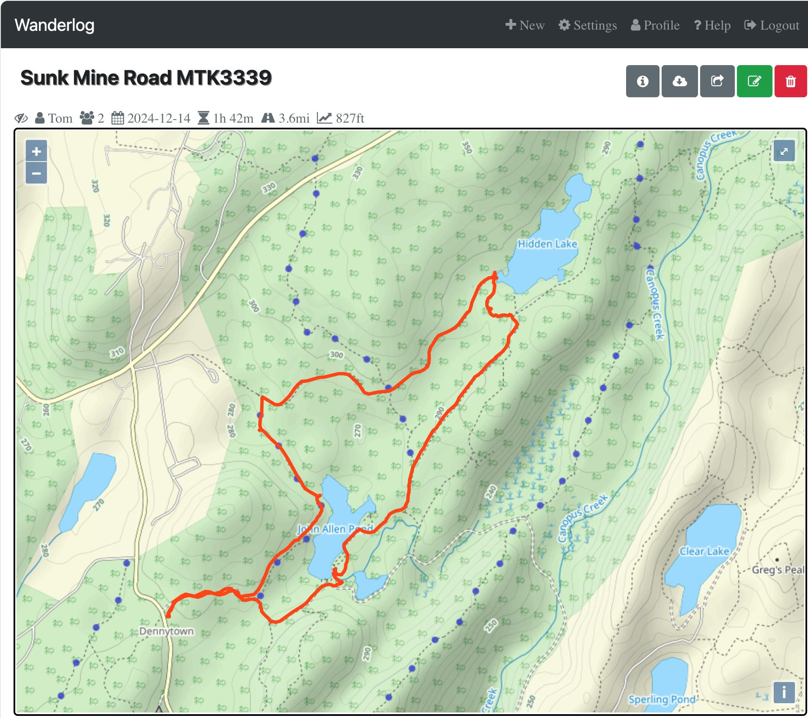

<!--
Copyright (c) 2024 Thomas Mikalsen. Subject to the MIT License 
-->


Rattlebox
=========
A GPS toolbox!

This repository pulls together my notes and the Python code that I had written
to work with the MediaTek 3339 GPS receiver. In particular, for logging and
exporting GPS track data (in GPX format) that can be imported into
[The Wanderlog](https://github.com/tommika/tommika/blob/main/wanderlog/wanderlog.md).

For example, using rattlebox, [this GPS data file](./doc/SunkMinRoad.gpx) was
exported and then imported into Wanderlog (as shown here): 



You may ask, _why bother? Can't your phone do that?_ Yes, it can. But, the MT3339 is a neat little
GPS unit, about the size of a dime, and I've been using it since 2015. 

Preliminaries
-------------

### Connecting the device to your system

I'm using a MTK3339 [breakout board](https://learn.adafruit.com/adafruit-ultimate-gps) from Adafruit,
with a USB to TTL serial cable, wired as follows:

* Red to VIN
* Black to GND
* Green to RX
* White to TX

With this setup, the MTK3339 will appear as a serial TTY device.
For example, on Linux it appears as`/dev/ttyUSB0`, 
macOS it appears as `/dev/tty.usbserial-410`, 
and on Windows as "COM6".

You may need additional permissions to access the device. For example, on Linux
you need to make yourself a member of the `dialout` group:

```
sudo usermod -a -G dialout `whoami`
```
and then restart the shell.

### Test the connection

On Linux / macOS, use `screen` to test your connection to the MTK3339 GPS receiver:

```
$ screen /dev/ttyUSB0 9600
```
The device defaults to 9600 baud. We'll be changing that to 115200.

While in `screen`, you can:

* Exit screen: `Ctrl-a + \`
* Detach and return to your shell: `Ctrl-a + d`. To re-attach later, use `screen -r`

(On Windows, you can use Putty.)

Building rattlebox
------------------

### Pre-reqs
* Anaconda (or better yet, [mini-conda](https://docs.anaconda.com/miniconda/))

### Setup Python environment and dependencies
```
make setup
```

### Activate the conda env
```
conda activate rattlebox
```

### Run tests
```
make test
```

### Install
```
make install
```

### Usage
To see usage and command list:
```
python -m rattlebox --help
```


### Run it
```
# Path to the device (depends on your system)
gpsr="/dev/tty.usbserial-410"

# Change baud to 115200 (device defaults to 9600)
python -m rattlebox ${gpsr} --baud=9600 baud-115200

# rattlebox defaults to 115200 baud, so we don't need to specify that anymore on
# command line

# Turn off NMEA output (we don't need it right now)
python -m rattlebox ${gpsr} output-off

# Stop logging, erase and get status
python -m rattlebox ${gpsr} logger-stop logger-erase logger-status

# Start logging
python -m rattlebox ${gpsr} logger-start logger-status

# Connect the device to a portable battery,
# and go for a hike ... 

# Stop logging and get status
python -m rattlebox ${gpsr} logger-stop logger-status

# Export log to GPX file
mkdir -p ./tmp
python -m rattlebox ${gpsr} logger-dump --log=tmp/my-log.gpx

# Enable NMEA output and continually echo (--follow)
python -m rattlebox ${gpsr} output-all --follow
```

References
----------

### LOCUS “basic” data format
This is the format of the log data returned by the "dump" command.

16 byte data block with the following fields.

* Timestamp (Unix/epoch UTC) - 4 bytes (#0-3) - unsigned long
* Fix type - 1 byte (#4) - byte/char [3d Fix==2] 
* Latitude - 4 bytes (#5-8) - 32bit single-precision floating-point
* Longitude - 4 bytes (#9-12) - 32bit single-precision floating-point
* Elevation - 2 bytes (#13-14) - short (meters)
* Checksum - 1 byte (#15)

(Values are little-endian)

For example, given

`<$PMTKLOX,1,2,9A00335F,022DC225,425DDE93,C26400CA, ...`

we have a 16-byte LOCUS data block as hex string

`9A00335F022DC225425DDE93C26400CA`.

Using spaces to separate the files, we get

`9A00335F 02 2DC22542 5DDE93C2 6400 CA`


_Timestamp_ (Unix/epoch UTC)

`9A 00 33 5F` = `0x5f33009a` = 1597178010

```
$ date -d "@1597178010"
Tue Aug 11 16:33:30 EDT 2020
```

(On macOS, use `gdate`)

_FIX_

`02` = `0x02` = 2 -- 3D fix

I've see the following values:
* 0
* 2
* 4

_Latitude_ (decimal degrees)

`2D C2 25 42` = `0x4225c22d` = 1109770797 = 41.439624786376953125 = 41°26'22.7"N

_Longitude_ (decimal degrees)
`5D DE 93 C2` = `0xc293de5d` = 3264470621 = -73.93430328369140625 = 73°56'03.5"W

_Elevation_ (integer meters)
`64 00` = `0x0064` = 100 = 100 meters / 328 feet

_Checksum_
`CA` = `0xca` = 202 - XOR of previous bytes in the data block [bytes 0 - 14]


### Links that I found helpful
* NMEA 0183 - https://en.wikipedia.org/wiki/NMEA_0183
* NMEA - http://aprs.gids.nl/nmea/
* LOCUS Manual - https://www.digikey.com/htmldatasheets/production/1931439/0/0/1/locus-library-manual.html


Notes
-----

\* The rattlebox icon image is AI-generated using [Google Gemini](https://gemini.google.com/)
